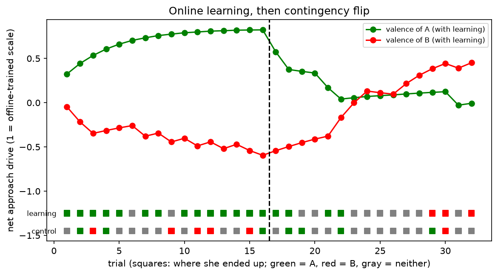

# Fruit Fly Toolkit

A small project that borrows two ideas from the fruit fly, tests them with measurements, and then connects them to the FlyWire connectome and a simulated fly body.

- **FlyHash:** the fly's olfactory circuit (sparse random expansion plus winner-take-all) used as a similarity-search index.
- **FOA:** the Fruit Fly Optimization Algorithm, used to tune FlyHash.
- **Connectome:** analysis of the FlyWire FAFB v783 brain, and a PN to Kenyon cell circuit built from the real wiring.
- **NeuroMechFly:** a simulated fly (FlyGym 2.1.0) that walks and steers toward an odour.

## Main findings

1. Tuned FlyHash matches exact cosine search on retrieval quality for real text (0.395 vs 0.399 same-newsgroup precision), at 0.83 recall of the exact neighbours.
2. FOA and random search tie on this tuning problem.
3. The four biggest mushroom-body hubs in the connectome are APL and DPM neurons.
4. The specific PN to Kenyon cell wiring never beat a degree-preserving shuffle in any test (recall, text retrieval, steering, odour discrimination). What mattered was sparse expansion with winner-take-all, and how evenly the PNs are used.
5. In steering, a sparse KC code with a readout discriminates two odours that a plain concentration signal cannot.

## Repository layout

| Path | What it does |
|---|---|
| `fruitfly/`, `app.py`, `tests/` | FlyHash index, FOA, FastAPI service (`/index`, `/search`, `/optimize/sphere`), pytest |
| `Dockerfile`, `.github/workflows/ci.yml` | Container and CI that runs the tests |
| `benchmark.py`, `tune.py`, `tune2.py`, `tune3.py` | Recall benchmark and FOA vs random tuning |
| `text_demo.py` | FlyHash on 20 Newsgroups text |
| `connectome/` | Graph analysis, hub plots, real-wiring FlyHash benchmarks |
| `flysim/` | NeuroMechFly demos: standing, walking, steering, controller comparisons |
| `figures/` | Result figures |

## Setup

- Core toolkit: Python with numpy, fastapi, uvicorn, pytest (`pip install -r requirements.txt`). Run `python -m pytest -q` and `uvicorn app:app --reload`.
- Connectome scripts: also need pandas, networkx, matplotlib, pyarrow, scipy. Download the FAFB v783 **Connections (Filtered)**, **Classification / Hierarchical Annotations** and **Consolidated cell types** tables from codex.flywire.ai into `connectome/data/` (not committed).
- Simulation scripts: FlyGym supports Python 3.9 to 3.12, so use a separate environment on Python 3.12 with `pip install flygym tqdm`. `text_demo.py` also needs scikit-learn.

## Results

### FlyHash tuning (1,000 random 128-d vectors, held-out queries, 3 seeds)

| Setting | recall@10 | ms/query |
|---|---|---|
| Default (expansion 20, wta 0.05, sample 0.10) | 0.345 | 4.3 |
| Random search, wta capped at 0.10 | 0.650 +/- 0.026 | 13.4 |
| FOA, wta capped at 0.10 | 0.667 +/- 0.028 | 15.2 |

- Tuning nearly doubles recall. FOA and random search are tied.
- Best settings sit at the search bounds, so recall is limited by code size, at about 3.5x the query time.
- Without the sparsity cap, both methods reach about 0.758 with wta near 0.30, so keeping the code fly-sparse costs about 0.09 recall.

### FlyHash on real text (20 Newsgroups, TF-IDF + SVD to 142 dimensions)

3,000 indexed documents, 150 queries per seed, 3 seeds, k=10. Precision is the fraction of retrieved documents from the query's own newsgroup (chance 0.05).

| Method | Recall vs exact cosine | Same-newsgroup precision |
|---|---|---|
| Exact cosine | 1.000 | 0.399 |
| FlyHash default | 0.521 | 0.316 |
| FlyHash tuned (exp 75, wta 0.10, sf 0.28) | 0.826 | 0.395 |
| Real PN to KC wiring, wta 0.05 / 0.10 | 0.320 / 0.328 | 0.260 / 0.277 |
| Shuffled wiring, wta 0.05 / 0.10 | 0.333 / 0.335 | 0.270 / 0.277 |
| Random in-degree, wta 0.05 / 0.10 | 0.390 / 0.542 | 0.304 / 0.354 |

- The tuned code uses 10,650 cells per document (about 1.3 KB as bits against 568 bytes for the raw vector), so there is no storage saving at these settings.
- Real wiring ties a degree-preserving shuffle. Evenly spread random wiring is better, increasingly so at higher sparsity.

### Connectome (FlyWire FAFB v783)

- 138,584 neurons and 3,732,460 connections (at least 5 synapses). Optic neurons are 56% of the brain but about 13% of the top 500 hubs by PageRank. Descending neurons are about 1% of the brain and 21% of those hubs.
- PageRank rewards neurons that receive from many well-connected neurons, so sensory neurons (sources) rank low by construction.
- The four biggest mushroom-body hubs are two APL and two DPM neurons (checked against the cell-type table).
- Real circuit (right hemisphere, connections of at least 5 synapses): 142 PNs, 2,376 Kenyon cells, 10,702 connections, about 4.5 inputs per Kenyon cell. The top 10 PNs hold 28.8% of the connections (even spread would be 7.0%).
- recall@10 against exact cosine on random vectors, 5 seeds: real wiring and a degree-preserving shuffle are tied in every setting; random wiring with matched in-degree is better by about 0.05 to 0.12 at wta 0.05 to 0.10.

### Simulated fly

A FlyGym walking demo reproduces the official tutorial (27.3 mm in 2 s against 27.34 mm). Steering uses the hybrid turning controller driven by a left/right antenna signal.

Single odour, 6 target angles x 3 seeds, target 12.8 mm away, arrival is within 3 mm:

| Controller | Arrived | Median time | Mean closest |
|---|---|---|---|
| Plain odour (gain 3.8) | 10/18 | 1.04 s | 3.5 mm |
| Circuit, real wiring (gain 3.0) | 12/18 | 1.06 s | 3.1 mm |
| Circuit, shuffled wiring (gain 3.0) | 12/18 | 1.07 s | 3.2 mm |

Two odours (A rewarded at 12.8 mm, B distractor at 8.0 mm, closer and on the opposite side; nearly uncorrelated PN patterns, about 93 KCs active each), 4 angles x 3 seeds:

| Controller | Reached A | Reached B | Neither | Median time to A |
|---|---|---|---|---|
| Plain concentration | 0 | 3 | 9 | - |
| Circuit, real wiring + readout | 11 | 0 | 1 | 1.04 s |
| Circuit, shuffled wiring + readout | 12 | 0 | 0 | 1.06 s |

## Caveats

- Synthetic and classic TF-IDF inputs, not real odour data or neural embeddings.
- The connection table is filtered at 5 synapses, and each PN is treated as an independent input dimension.
- The odour discrimination readout is set directly from the two odours (no learning), with one odour pair and 12 trials per controller.
- Sample sizes are small, so differences of one or two trials are within noise.

## Brain-in-the-loop steering (whole-brain connectome rate model)

A rate network built from the FAFB v783 connections (acetylcholine excitatory, GABA and glutamate inhibitory; other transmitters ignored; each neuron's inputs normalised to sum to 1). Odour at the left and right antenna drives the left and right olfactory neurons; the left/right difference in descending-neuron activity (baseline subtracted) sets the walking turn. 4 angles x 2 seeds, target 12.8 mm away, arrival is within 3 mm:

| Controller | Arrived | Median time | Mean closest |
|---|---|---|---|
| Plain odour (gain 3.8) | 4/8 | 1.08 s | 3.3 mm |
| Real brain (olfactory -> descending, gain 10) | 8/8 | 1.21 s | 3.0 mm |
| Side-matched random neurons (gain 10) | 8/8 | 1.03 s | 3.0 mm |
| Side-matched random, opposite sign | 0/8 | - | 11.3 mm |

- The connectome network steers the walking fly to the odour, in the sign where more left-descending activity turns the fly left.
- Random neurons chosen from the matching hemisphere steer just as well, so the steering depends on left/right lateralisation and not on the specific olfactory-to-descending wiring. (A control that mixed hemispheres failed, which only shows that lateralisation matters.)
- The plain-odour reference used a lower gain than the brain controllers, so the gap between them is not a fair comparison.
- Caveats: a crude rate model (not the published leaky integrate-and-fire models), 8 trials per row, one odour source, a hand-chosen mapping from descending-neuron balance to turning.

## Learning: mushroom-body plasticity steering a walking fly

Real KC -> MBON connectivity (5,177 Kenyon cells, 96 MBONs, 26,937 connections) from the FAFB connectome. Two odours are sets of 8 olfactory-receptor types each (disjoint), pushed through the whole-brain rate model; the top 5% of KCs (~258 per odour, 2.8% overlap between the two) form the code. MBONs are split at random into approach and avoid groups (the real valence assignment is not used). Learning is dopamine-style depression: pairing an odour with reward weakens its KC synapses onto avoid-MBONs, pairing with punishment weakens approach-MBONs. Net approach drive for each odour, read at the left and right antenna, sets the walking turn.

Probe (10 random odour pairs and MBON splits): preference index for A over B (range -2 to +2) before training 0.03, after 10 trials of A rewarded and B punished +1.31, after reversal -1.28. Real and shuffled (degree-preserving) wiring tie (1.31 vs 1.32; -1.28 vs -1.33).

Walking in the arena (A rewarded odour at 12.8 mm, B at 8.0 mm, closer and on the opposite side; 4 angles x 2 seeds), same gain in all conditions:

| Condition | Reached A | Reached B | Neither |
|---|---|---|---|
| Naive | 1 | 1 | 6 |
| Trained (A good, B bad) | 8 | 0 | 0 |
| Reversed (A bad, B good) | 0 | 8 | 0 |

- The trained fly walks to the farther rewarded odour past the nearer one; after reversal she walks to the other.
- Without synaptic recovery, reversal was weak (0 A, 2 B, 6 neither) because depression is permanent in the rule. A recovery step (depressed synapses move 10% of the way back each trial) was added after seeing this, so it was not a pre-planned parameter.
- Caveats: the weights are trained offline and frozen during each walk (no learning from experience inside the simulation), one odour pair, one random approach/avoid split, 8 trials per condition, no shuffled-wiring control in the walking test.

## Online learning: learning from experience, then a contingency flip

A naive fly walks 32 trials in the two-odour arena (A at 12.8 mm, B at 8.0 mm, closer and on the opposite side; random target angle each trial). KC-to-MBON weights carry over between trials. Coming within 6 mm of a source triggers the signal (my design choice, so near passes teach her): in trials 1-16 A is rewarded and B punished, in trials 17-32 the contingency is flipped. Depressed synapses recover 10% per trial. A no-learning control runs the same trial sequence with fixed weights.

Run 1 (no exploration noise):

| Trials | Learning: A / B / neither | Control: A / B / neither |
|---|---|---|
| 1-16 | 15 / 0 / 1 | 0 / 0 / 16 |
| 17-32 | 2 / 1 / 13 | 0 / 0 / 16 |

After the flip she stopped going to A but barely relearned B, and the control never reached a source. I suspected a stall: with near-zero drive she wanders without visiting a source, so no reinforcement arrives.

Run 2 (exploration noise added after run 1, so a post-hoc change; the figure shows this run, and run 1's plot was not kept):

| Trials | Learning: A / B / neither | Mean valence A, B | Control: A / B / neither |
|---|---|---|---|
| 1-16 | 14 / 0 / 2 | A +0.48 to +0.82, B -0.23 to -0.53 | 3 / 5 / 8 |
| 17-32 | 4 / 3 / 9 | A +0.41 to +0.05, B -0.48 to +0.42 | 4 / 1 / 11 |

- She learns from experience: 14 of 16 arrivals at the rewarded odour, passing the closer one, against 3 of 16 for the control (chance level for A is about 19%).
- After the flip she unlearns A within about 8 trials, and B's valence turns positive around trial 25. She reaches B in 3 of the last 4 trials, but the run ends just as relearning starts, so reversal is incomplete. Reversal is slower than acquisition (about 12 trials against about 4).
- The stall explanation is only partly supported (4 of 4 time-outs when both valences were near zero), and I have no per-trial logs to test it.
- Caveats: 6 mm reinforcement radius chosen by me, random approach/avoid assignment of the MBONs, one odour pair, one trial sequence, a 10% recovery rate chosen after an earlier weak reversal, and exploration noise added after run 1. Learning and control used different random noise streams.

Run 3 (longer series: 24 trials per phase, no control rerun; figure `figures/online_learning_long.png`):

| Trials | Learning: A / B / neither | Mean valence A, B |
|---|---|---|
| 1-24 (A rewarded, B punished) | 21 / 0 / 3 | A +0.48 to +0.80, B -0.23 to -0.46 |
| 25-48 (flipped) | 4 / 9 / 11 | A +0.46 to +0.00, B -0.39 to +0.58 |

- Acquisition is stable (21 of 24 at the rewarded odour); the first 16 trials reproduce run 2 exactly.
- After the flip she unlearns A in about 8 trials and relearns B in about 12; B's valence reaches +0.58, close to the offline-reversed value (+0.59).
- She reaches B in 9 of the last 16 trials (6 of the last 12), so reversal is complete in valence but only partial in behaviour. Untested explanations: exploration noise, and A's valence staying near zero because she seldom visits A in phase 2 to be punished.
- The no-learning control was not rerun for 48 trials; in run 2 it reached B in 1 of 16 phase-2 trials.

## Valence-faithful MBON groups (offline probe)

The random approach/avoid split of MBONs was replaced by MBON types whose activation is reported to drive avoidance (MBON01-05, glutamatergic horizontal-lobe types) or approach (MBON09, MBON11, MBON12; GABAergic and cholinergic). The assignment comes from secondary sources quoting Aso et al. 2014; the paper itself was not opened. Type numbers 01-05 are from the paper's table. The numbering of 09, 11 and 12 was from memory and checked against the connectome's predicted transmitter: MBON01/03/04 glutamate (100%), MBON09/11 GABA (100%), MBON12 acetylcholine (100%); MBON02 (56% GABA, 44% glutamate) and MBON05 (50% acetylcholine, 50% glutamate) are ambiguous. Groups: 10 avoid and 10 approach MBONs, with 6,093 and 7,872 KC-to-MBON connections.

Preference for A over B (10 random odour pairs, rule with 10% recovery): faithful valence on real wiring -0.008 / 1.321 / -0.839 (before / after training / after reversal), on shuffled wiring 0.025 / 1.339 / -0.810, random split of all MBONs -0.005 / 1.322 / -0.834.

All conditions agree because the normalised preference index is set by the rule constants (10 trials of 15% depression leave 20% of the weight, giving about 1.34 when approach and avoid inputs are balanced; the reversal value follows from the 10% recovery), so this probe cannot discriminate wiring or valence assignments. It shows only that the rule works on these groups. The earlier probe values (1.31 and -1.28) share this limitation.
