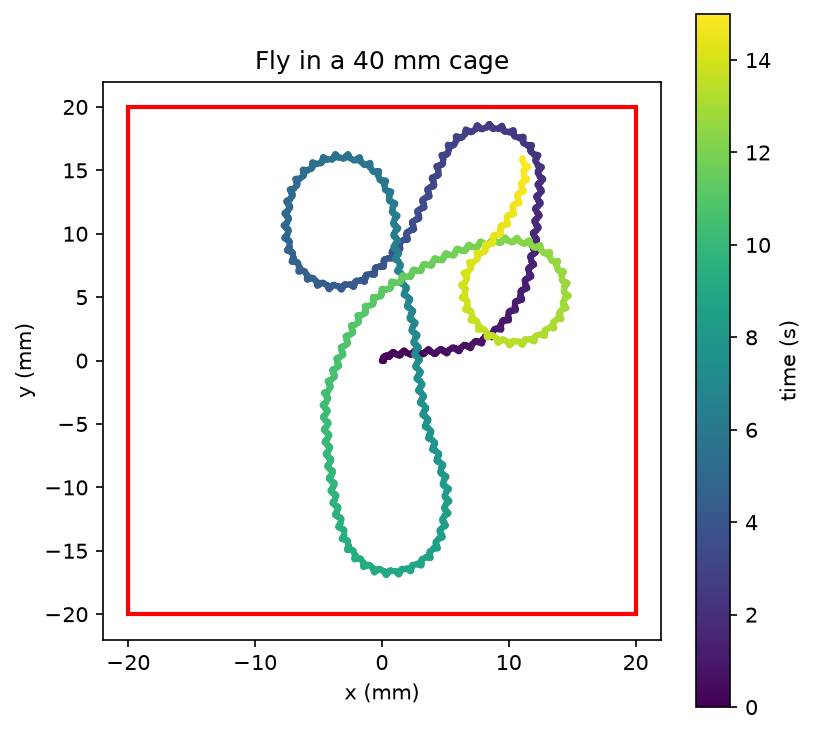
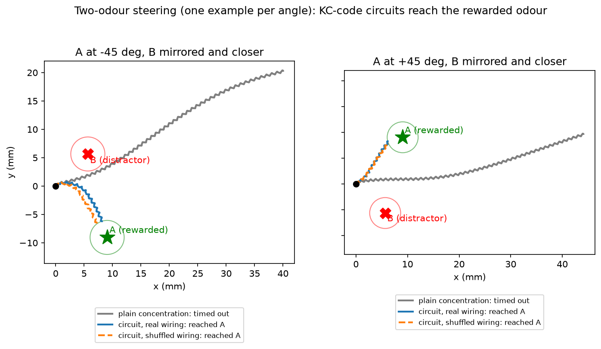
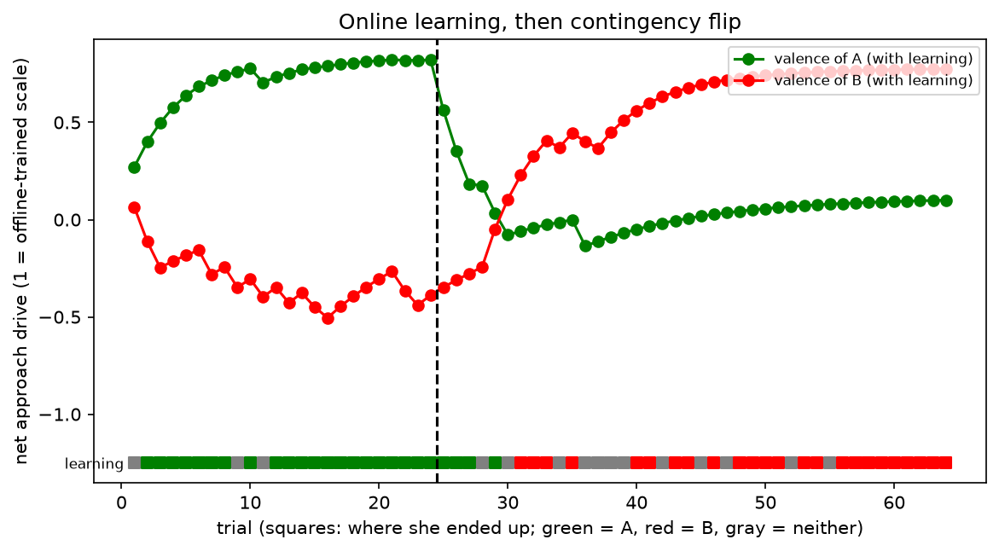
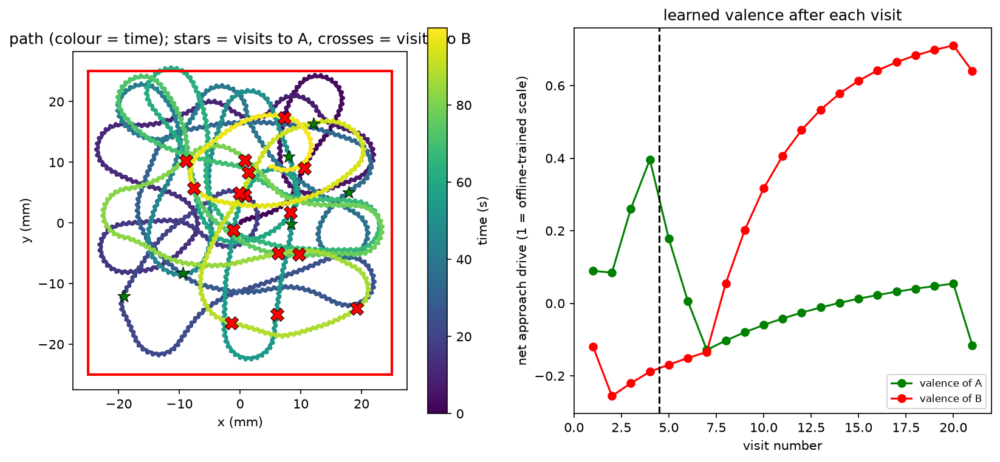

# Fruit Fly Toolkit

A project that starts from two fruit-fly-inspired algorithms (FlyHash similarity search and the Fruit Fly Optimization Algorithm), then connects them to the real FlyWire connectome and to a simulated fly body (NeuroMechFly, via FlyGym 2.1.0). In simulation the fly walks inside a cage, is steered toward an odour by a connectome-based brain model, and learns from experience with a mushroom-body learning rule. **She walks; she does not fly** (see Limits).

## Main findings

1. Tuned FlyHash matches exact cosine search on retrieval quality for real text (same-newsgroup precision 0.395 vs 0.399) at 0.83 recall of the exact neighbours, but its code is larger than the raw vector.
2. FOA ties random search on the FlyHash tuning problem.
3. Four of the top eight connectome hubs by PageRank are the mushroom-body feedback neurons APL (two) and DPM (two), identified from the cell-type table.
4. The specific PN to Kenyon-cell pairing in the real connectome never beat a degree-preserving shuffle in any test (FlyHash recall, text retrieval, steering, odour discrimination). Sparse expansion with winner-take-all, and how evenly PNs are used, is what mattered.
5. A whole-brain connectome rate model placed in the walking loop steers the fly to an odour. A random network with the same hemisphere layout steers equally well, so the steering comes from left/right lateralisation, not from olfactory wiring.
6. With a mushroom-body learning rule (dopamine-style depression of KC to MBON synapses) the fly learns from her own experience which of two odours is good, and relearns after the reward is flipped (about 16 trials to reverse, against 4 or fewer for the first lesson).
7. In a continuous 160 s cage episode with two odours and a mid-run reward flip, learning flies make more of their visits to the rewarded odour than no-learning controls: before the flip 71% vs 53% (seeds 0-4) and 80% vs 39% in a held-out replication (seeds 5-9, 5 of 5 seeds); after the flip 67% vs 41% and 59% vs 50% (4 of 5 and 3 of 5 seeds), so the post-flip effect is weaker and less certain; two of ten learning runs (seeds 3 and 9) did not relearn.

## Repository layout

| Path | What it does |
|---|---|
| `fruitfly/`, `app.py`, `tests/` | FlyHash index, FOA, FastAPI service (`/index`, `/search`, `/optimize/sphere`), pytest |
| `Dockerfile`, `.github/workflows/ci.yml`, `pytest.ini` | Container and CI (pytest runs only `tests/`) |
| `benchmark.py`, `tune.py`, `tune2.py`, `tune3.py`, `text_demo.py` | Recall benchmark, FOA vs random tuning, FlyHash on text |
| `connectome/` | Graph analysis and hub plots, real-wiring FlyHash benchmarks, brain model probe, learning and valence probes |
| `flysim/` | NeuroMechFly demos: standing, walking, cage, steering, brain-in-the-loop, learning and diagnostics (`stand.py`, `walk.py`, `cage.py`, `steer.py`, `brain_steer.py`, `learn_steer.py`, `online_learning*.py`, `*_diagnostic.py`, `phase2_replay.py`, `capstone*.py`) |
| `figures/` | Result figures |
| `results/` | Per-episode capstone results (JSON, 5 seeds x learning and control) |

## Setup

- **Core toolkit:** `pip install -r requirements.txt`, then `python -m pytest -q` and `uvicorn app:app --reload`. `text_demo.py` also needs scikit-learn.
- **Connectome scripts:** need pandas, networkx, matplotlib, pyarrow, scipy. Download the FAFB v783 **Connections (Filtered)**, **Classification / Hierarchical Annotations** and **Consolidated cell types** tables from codex.flywire.ai into `connectome/data/` (not committed).
- **Simulation scripts:** FlyGym supports Python 3.9 to 3.12, so use a separate Python 3.12 environment with `pip install flygym tqdm pandas scipy`. The first run of `flysim/brain_steer.py` builds and caches the brain model (`connectome/brain_W.npz`, not committed); the learning scripts reuse it.

## FlyHash and FOA

Recall@10 against exact cosine search (1,000 random 128-d vectors, held-out queries, 3 seeds):

| Setting | recall@10 | ms/query |
|---|---|---|
| Default (expansion 20, wta 0.05, sample 0.10) | 0.345 | 4.3 |
| Random search, wta capped at 0.10 | 0.650 +/- 0.026 | 13.4 |
| FOA, wta capped at 0.10 | 0.667 +/- 0.028 | 15.2 |

Without the sparsity cap FOA and random search both reach about 0.757 (0.758 +/- 0.002 and 0.755 +/- 0.004) with wta near 0.30, so keeping the code fly-sparse costs about 0.09 recall. Best settings sit at the search bounds, so recall is limited by code size, at about 3.5x the query time.

### On real text (20 Newsgroups, TF-IDF + SVD to 142 dimensions)

3,000 indexed documents, 150 queries per seed, 3 seeds, k=10. Precision is the fraction of retrieved documents from the query's own newsgroup (chance 0.05).

| Method | Recall vs exact cosine | Same-newsgroup precision |
|---|---|---|
| Exact cosine | 1.000 | 0.399 |
| FlyHash default | 0.521 | 0.316 |
| FlyHash tuned (exp 75, wta 0.10, sf 0.28) | 0.826 | 0.395 |
| Real PN to KC wiring, wta 0.05 / 0.10 | 0.320 / 0.328 | 0.260 / 0.277 |
| Shuffled wiring, wta 0.05 / 0.10 | 0.333 / 0.335 | 0.270 / 0.277 |
| Random in-degree wiring, wta 0.05 / 0.10 | 0.390 / 0.542 | 0.304 / 0.354 |

The tuned code uses 10,650 cells per document (about 1.3 KB as bits against 568 bytes for the raw vector), so there is no storage saving at these settings.

## Connectome (FlyWire FAFB v783)

- 138,584 neurons and 3,732,460 connections (at least 5 synapses). Optic neurons are 56.1% of the brain but 12.8% of the top 500 hubs by PageRank; central 23.3% to 47.4%; descending 0.9% to 21.2%; sensory 11.9% to 0.0%. PageRank rewards neurons that receive from many well-connected neurons, so sensory neurons (sources) rank low by construction.
- Real PN to Kenyon-cell circuit (right hemisphere, the side with more Kenyon cells): 142 PNs, 2,376 Kenyon cells, 10,702 connections, about 4.5 inputs per Kenyon cell. The top 10 PNs hold 28.8% of the connections (an even spread would give 7.0%); the biggest PN feeds 492 Kenyon cells, the median PN about 60.
- recall@10 against exact cosine, 5 seeds (real wiring, degree-preserving shuffle, random wiring with matched in-degree):

| Data | wta | Real | Shuffled | Random in-degree |
|---|---|---|---|---|
| Gaussian | 0.05 | 0.233 | 0.235 | 0.289 |
| Gaussian | 0.10 | 0.266 | 0.265 | 0.381 |
| Correlated (synthetic) | 0.05 | 0.647 | 0.642 | 0.718 |
| Correlated (synthetic) | 0.10 | 0.666 | 0.663 | 0.782 |

Real and shuffled wiring tie. Evenly spread random wiring is better, which fits the uneven PN fan-out.

## Simulated fly

The walking demo reproduces the official FlyGym tutorial (27.3 mm in 2 s against 27.34 mm). In `flysim/cage.py` she wanders in a 40 mm box with a wall-avoidance rule in the controller (not a physical wall) and stayed inside it in a 15 s run.

### Steering from a left/right antenna signal

Single odour, 6 angles x 3 seeds, target 12.8 mm away, arrival is within 3 mm:

| Controller | Arrived | Median time | Mean closest |
|---|---|---|---|
| Plain odour (gain 3.8) | 10/18 | 1.04 s | 3.5 mm |
| Sparse KC circuit, real wiring (gain 3.0) | 12/18 | 1.06 s | 3.1 mm |
| Sparse KC circuit, shuffled wiring (gain 3.0) | 12/18 | 1.07 s | 3.2 mm |

Two odours (A rewarded at 12.8 mm, B distractor at 8.0 mm, closer and on the opposite side; nearly uncorrelated PN patterns), 4 angles x 3 seeds. The KC circuits use a readout set directly from the two odours:

| Controller | Reached A | Reached B | Neither |
|---|---|---|---|
| Plain concentration | 0 | 3 | 9 |
| Circuit, real wiring + readout | 11 | 0 | 1 |
| Circuit, shuffled wiring + readout | 12 | 0 | 0 |

### Whole-brain connectome model in the loop

A rate network built from the FAFB connections (acetylcholine excitatory, GABA and glutamate inhibitory; other transmitters ignored; each neuron's inputs normalised to sum to 1). Odour at the left and right antenna drives the left and right olfactory neurons; the left/right difference in descending-neuron activity (baseline subtracted) sets the turn. 4 angles x 2 seeds:

| Controller | Arrived | Median time | Mean closest |
|---|---|---|---|
| Plain odour (gain 3.8) | 4/8 | 1.08 s | 3.3 mm |
| Real brain, olfactory to descending (gain 10) | 8/8 | 1.21 s | 3.0 mm |
| Side-matched random neurons (gain 10) | 8/8 | 1.03 s | 3.0 mm |
| Side-matched random, opposite sign | 0/8 | - | 11.3 mm |

The side-matched random network steers as well as the real brain: the effect is lateralisation. (An earlier control that mixed hemispheres failed, which only shows that lateralisation matters.) The plain-odour row used a lower gain, so that comparison is not like-for-like.

## Learning

MBONs are split into approach and avoid groups. Learning is dopamine-style depression: pairing an odour with reward weakens its KC synapses onto avoid-MBONs, pairing with punishment weakens approach-MBONs, with 10% recovery per trial. Net approach drive for each odour, read at the two antennae, sets the turn. Two odours are disjoint sets of 8 olfactory-receptor types, each giving about 258 active KCs (2.8% overlap).

**Valence assignments.** The first runs used a random 50/50 split of the 96 MBONs. The later runs use MBON types reported to drive avoidance (MBON01-05, glutamatergic horizontal-lobe types) or approach (MBON09, MBON11, MBON12; GABAergic and cholinergic), taken from secondary sources quoting Aso et al. 2014 (the paper itself was not opened). Types 01-05 are numbered in the paper's table; the numbering of 09, 11 and 12 was checked against the connectome's predicted transmitter (01/03/04 glutamate 100%, 09/11 GABA 100%, 12 acetylcholine 100%; MBON02 56% GABA and 44% glutamate, MBON05 50% acetylcholine and 50% glutamate, both ambiguous). The groups have 10 avoid and 10 approach MBONs, with 6,093 and 7,872 KC to MBON connections.

**Offline walking test** (weights trained beforehand and frozen, A at 12.8 mm, B at 8.0 mm closer, 4 angles x 2 seeds): naive reaches A 1, B 1, neither 6; trained (A good, B bad) 8 / 0 / 0; reversed (A bad, B good) 0 / 8 / 0. Without synaptic recovery, reversal was weak (0 / 2 / 6), so recovery was added after seeing that result.

**Online learning** (a naive fly, weights carried between trials, reinforcement when she comes within 6 mm of a source; A rewarded and B punished in phase 1, flipped in phase 2). Outcomes as A / B / neither:

| Run | Setup | Phase 1 | Phase 2 |
|---|---|---|---|
| 1 | random split, no exploration noise, 16 + 16 trials | 15 / 0 / 1 | 2 / 1 / 13 |
| 2 | random split, exploration noise, 16 + 16 | 14 / 0 / 2 | 4 / 3 / 9 |
| 3 | random split, noise, 24 + 24 | 21 / 0 / 3 | 4 / 9 / 11 |
| 4 | valence-faithful groups, noise, 24 + 24 | 21 / 0 / 3 | 4 / 10 / 10 |
| 5 | valence-faithful groups, noise, 24 + 40 | 21 / 0 / 3 | 4 / 24 / 12 |

The no-learning control (runs 1 and 2, same trial sequence, fixed weights) reached A in 0 of 16 phase-1 trials in run 1 and 3 of 16 in run 2; it never learned to prefer either odour.

- She learns from experience: 21 of 24 trials at the rewarded odour, past the closer one.
- After the flip she stops going to A (no A arrivals after trial 32) and relearns B: in run 5 she reaches B in 14 of the last 16 trials (4 of 4 in the final two blocks), the same as frozen reversed weights replayed on the same trial angles and controller seeds (about 14 of 16 in their last four blocks). The earlier partial reversal was the time needed to relearn. The cause of the slower reversal was not tested.
- A's learned valence drifts back to its naive value because she no longer visits A to be punished: she forgets A and does not learn to avoid it.
- The result does not depend on which MBONs carry approach or avoid valence (runs 3 and 4 match). Exploration noise and zeroing A's drive cost at most one trial in the frozen diagnostics (8/8 and 7/8 reaching B), so neither explains the slower online reversal.
- The offline preference index in the earlier learning probes (about 1.3 after training) is set by the rule constants (15% depression, 10% recovery, trial counts) and is the same for any wiring or MBON assignment, so those probes show only that the rule works.

## Capstone: cage, odours and learning in one run

`flysim/capstone.py` runs one continuous 100 s episode in a 50 mm box with no resets. Odours A and B sit at random positions at least 10 mm apart. Coming within 6 mm of a source counts as a visit: it triggers the KC to MBON learning rule (valence-faithful MBON groups, 10% recovery per visit) and respawns that source elsewhere. A is rewarded and B punished until 40 s, then the contingency is flipped. Steering uses the learned approach drive read at the two antennae, and a wall rule turns her toward the centre when she is within 6 mm of an edge. The no-learning control uses the same seed with weights frozen at their naive values. The whole-brain rate model is not in this loop (its steering turned out to be lateralisation), so the learned circuit is the real KC to MBON connectivity only. A 100 s run takes about 13 minutes.

| | Phase 1 (0-40 s, A rewarded) | Phase 2 (40-100 s, B rewarded) |
|---|---|---|
| With learning | 4 visits (2 A, 2 B), 50% at A | 17 visits (4 A, 13 B), 76% at B |
| No-learning control | 7 visits (3 A, 4 B), 43% at A | 12 visits (5 A, 7 B), 58% at B |

- Everything ran together: she stayed in the box (0.4% of the time outside for under 1 mm, furthest 25.7 mm against the 25 mm wall; control 0.0%, 24.9 mm) and found sources about once every 5 s with or without learning (21 and 19 visits).
- The learned valence follows the contingency: A rises to about +0.4 after rewarded visits and falls to about -0.1 after the flip; B falls to about -0.26 after punished visits, then rises to about +0.7 over the 17 visits after the flip.
- Behavioural evidence is weak: only 4 visits happened before the flip, and 13 of 17 phase-2 visits at B against 7 of 12 in the control is well within chance at these counts. One run, one seed per condition.
- Caveats: the wall is a rule in the controller (small excursions occurred), sources respawn at random positions, and the learning parameters are the ones chosen in the earlier runs.

### Capstone, multi-seed (5 seeds, 160 s episodes, flip at 60 s)

The single 100 s run above was a first attempt. `flysim/capstone_multi.py` repeats the capstone for seeds 0 to 4, each with a learning run and a no-learning control (160 s episodes, flip at 60 s, same 50 mm box). Each episode is saved under `results/`; `flysim/capstone_summary.py` and `flysim/capstone_extra.py` summarise them. The criterion was fixed before the runs: learning has a higher share of visits at the rewarded odour than the control in both phases pooled, with the direction holding in a majority of seeds (written as 2 of 3 seeds for the first three seeds and extended to a majority of 5 before seeds 3 and 4 were run; the result also holds under at least 4 of 5). Outcome: met, with 4 of 5 seeds in the right direction in each phase.

| Seed | Phase 1, share at A: learning vs control | Phase 2, share at B: learning vs control |
|---|---|---|
| 0 | 71% (5/2) vs 43% (6/8) | 72% (8/21) vs 62% (6/10) |
| 1 | 77% (10/3) vs 56% (9/7) | 46% (7/6) vs 38% (13/8) |
| 2 | 50% (4/4) vs 60% (6/4) | 80% (5/20) vs 42% (11/8) |
| 3 | 60% (9/6) vs 43% (3/4) | 12% (7/1) vs 40% (12/8) |
| 4 | 92% (11/1) vs 67% (4/2) | 74% (8/23) vs 29% (17/7) |
| pooled | 71% (39/16) vs 53% (28/25) | 67% (35/71) vs 41% (59/41) |
| late phase 2 (110-160 s) | | 75% (13/40) vs 36% (32/18) |

- The control shows a mild bias toward A (53% at A in phase 1, 41% at B in phase 2), consistent with its naive valence (A +0.10, B +0.06), so learning should be compared with the control and not with 50%.
- The learned valence follows the contingency: at the end A is -0.08 to -0.29 in all five seeds, and B is +0.56 to +0.72 in four seeds and +0.02 in seed 3. Learning and control found sources equally often (161 and 153 visits). Time outside the box was 0.0% to 0.4%, furthest 26.2 mm against the 25 mm wall.
- Right after the flip learning flies are not better than the control (first 20 s: 2 of 5 seeds, pooled 46% vs 46%): they still carry the old preference. In the last 20 s before the flip learning is ahead in 4 of the 4 seeds where the control had visits, and in late phase 2 in 4 of 5 seeds.
- Seed 3 did not relearn: after the flip 7 of its 8 visits went to A and 1 to B, so B was rewarded once and its valence ended at +0.02. This is consistent with reward arriving only on chance visits; it is one seed.
- Evidence is moderate. 20 s bins are noisy (in the first 20 s, when both groups are still naive, pooled shares were 50% vs 32%; in 20-40 s 71% vs 80%). Pooled shares treat visits as independent although each seed is one continuous run, so no p-values are quoted. Five seeds, one odour pair, and parameters chosen in earlier runs.

#### Time-based recovery (post hoc, criterion not met)

Seed 3 did not relearn (see above). I proposed a possible cause after seeing it: recovery of depressed synapses happened only on visits, so a fly that stops visiting a source cannot regain interest in it. I added time-based recovery (depressed weights drift back to their naive values with a 30 s time constant, the only value tried) and reran the five learning episodes (`flysim/capstone_decay.py`, `results/capstone_decay_seed*_learn.json`; controls reused, since their weights are frozen). Criterion fixed before the runs: late-phase (110-160 s) share at B of at least 60% with at least 5 visits in all 5 seeds, and pooled phase-1 share at A of at least 65%. Outcome: **not met**. Four of 5 seeds passed; seed 3 reached 50% on 6 visits. The pooled phase-1 condition passed narrowly (66%, 40 of 61 visits).

| Seed | Phase 2, share at B: no-decay / time-decay / control | Late phase, share at B: no-decay / time-decay / control |
|---|---|---|
| 0 | 72% / 77% / 62% | 81% / 80% / 57% |
| 1 | 46% / 76% / 38% | 80% / 87% / 27% |
| 2 | 80% / 70% / 42% | 85% / 73% / 29% |
| 3 | 12% / 47% / 40% | 0% / 50% / 50% |
| 4 | 74% / 50% / 29% | 75% / 60% / 18% |
| pooled | 67% / 67% / 41% | 75% / 73% / 36% |

- Pooled results are the same with and without time decay, so it neither helps nor hurts overall. Seed 3 improved (B valence at the end +0.02 to +0.31) and seed 4 got worse (phase 2 at B 74% to 50%); per-seed differences between the two versions are mostly different random trajectories, since runs diverge once the learned values differ. The decay shrinks the learned values (end valence of B +0.31 to +0.59 against +0.56 to +0.72 without it, apart from seed 3).
- The comparison with controls replicates: time-decay learning is ahead of its control in phase 2 in 5 of 5 seeds (seed 3 only slightly) and pooled 67% vs 41%.
- Whether the stuck dynamic explains seed 3 remains untested. This change was chosen after seeing seed 3, so the no-decay five-seed result remains the primary one.

### Held-out replication (seeds 5-9)

Seeds 0-4 were used while the experiment was being developed, so the capstone was rerun without changes (same code and parameters, no time decay) on five fresh seeds (`flysim/capstone_holdout.py`, `flysim/capstone_holdout_summary.py`, `results/capstone_seed5..9_*.json`). Criterion fixed before the runs: learning is ahead of the control in pooled share of visits at the rewarded odour in both phases (phase 1 share at A, phase 2 share at B), and ahead in at least 3 of 5 seeds in each phase. Outcome: **met**, with the stricter reading (at least 4 of 5 in both phases) not holding.

| Seed | Phase 1, share at A: learning vs control | Phase 2, share at B: learning vs control |
|---|---|---|
| 5 | 67% (6/3) vs 33% (2/4) | 68% (10/21) vs 47% (10/9) |
| 6 | 77% (10/3) vs 38% (5/8) | 65% (8/15) vs 46% (13/11) |
| 7 | 92% (23/2) vs 38% (5/8) | 70% (7/16) vs 57% (9/12) |
| 8 | 75% (15/5) vs 42% (5/7) | 50% (11/11) vs 53% (9/10) |
| 9 | 76% (13/4) vs 43% (3/4) | 18% (9/2) vs 45% (12/10) |
| pooled | 80% (67/17) vs 39% (20/31) | 59% (45/65) vs 50% (53/52) |

- Phase 1 replicates strongly (5 of 5 seeds, gap larger than in seeds 0-4). Phase 2 replicates weakly: 3 of 5 seeds, pooled gap of 9 points on 110 and 105 visits, against 26 points in seeds 0-4. Late phase 2 (110-160 s, not part of the criterion): 75% (16/47) vs 52% (26/28), learning ahead in 4 of 5 seeds, against 75% vs 36% in seeds 0-4 (the learning share is unchanged; the control share is higher).
- Seed 9 did not relearn (9 visits to A and 2 to B after the flip, end valence of B +0.22), as seed 3 in the first set; two of ten learning runs got stuck after the flip. Seed 8 sat at 50% in phase 2 and reached 64% late.
- The control share varies between seed sets (phase 1 at A: 53% in seeds 0-4, 39% in seeds 5-9). Learning flies made more visits (194 vs 156 here, 355 vs 309 over ten seeds); not investigated.
- The fly stayed in the box (0.0% to 0.3% of the time outside, furthest 25.9 mm against the 25 mm wall). Learned valences end with A at -0.09 to -0.40 and B at +0.50 to +0.72 (seed 9: +0.22).
- All ten seeds, descriptive only (seeds 0-4 informed the design): phase 1 at A 76% (106/33) vs 46% (48/56), phase 2 at B 63% (80/136) vs 45% (112/93), late phase 2 at B 75% (87/116) vs 44% (46/104); learning ahead in 9 of 10 seeds in phase 1, 7 of 10 in phase 2, 8 of 10 in the late phase.

## Not done: flight

The NeuroMechFly walking body has no wing flight. The flybody model (DeepMind/Janelia) has wings and installs and renders on Windows, but its repository ships no trained flight policy and points to a distributed reinforcement-learning training script that needs Linux and a TensorFlow stack. Flight would mean training a flight controller from scratch, which was not attempted.

## Limits and caveats

- Inputs are synthetic or classic TF-IDF vectors, not real odour data or neural embeddings; the connection table is filtered at 5 synapses and each PN is treated as an independent input dimension.
- The brain model is a crude rate model, not a leaky integrate-and-fire model, and the mapping from descending-neuron balance to turning is hand-chosen. The cage wall is a rule in the controller.
- Sample sizes are small (4 to 24 trials per condition, one odour pair, one trial sequence for the learning runs), so differences of one or two trials are within noise. Several parameters were chosen after seeing earlier results (10% synaptic recovery, exploration noise, the 6 mm reinforcement radius).
- Valence assignments come from secondary sources and two types have ambiguous transmitters.
